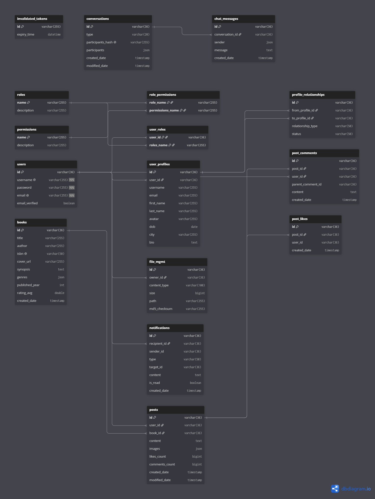

# Thiết kế Cơ sở Dữ liệu Chi tiết Bookify

---

## 1. Identity Service (MySQL)
*Công nghệ: Spring Data JPA + MySQL*

### Bảng: `user`
* `id`: VARCHAR(36) [PK, UUID]
* `username`: VARCHAR(255) [UNIQUE, NOT NULL]
* `password`: VARCHAR(255) [NOT NULL]
* `email`: VARCHAR(255) [UNIQUE, NOT NULL]
* `email_verified`: BOOLEAN [DEFAULT false]
* `verification_otp`: VARCHAR(4) [Bổ sung: Mã OTP 4 số]
* `otp_expiry_time`: DATETIME [Bổ sung: Thời hạn mã OTP]
* `last_otp_sent_time`: DATETIME [Bổ sung: Thời gian gửi mã OTP gần nhất]
* `otp_attempt_count`: INT [DEFAULT 0, Bổ sung: Số lần nhập sai OTP]

### Bảng: `role`
* `name`: VARCHAR(255) [PK]
* `description`: VARCHAR(255)

### Bảng: `permission`
* `name`: VARCHAR(255) [PK]
* `description`: VARCHAR(255)

### Bảng: `invalidated_token`
* `id`: VARCHAR(255) [PK]
* `expiry_time`: DATETIME

### Bảng trung gian: `user_roles`
* `user_id`: VARCHAR(36) [FK -> user.id]
* `roles_name`: VARCHAR(255) [FK -> role.name]
* PRIMARY KEY (`user_id`, `roles_name`)

### Bảng trung gian: `role_permissions`
* `role_name`: VARCHAR(255) [FK -> role.name]
* `permissions_name`: VARCHAR(255) [FK -> permission.name]
* PRIMARY KEY (`role_name`, `permissions_name`)

---

## 2. Profile Service (Neo4J - Graph DB)
*Công nghệ: Spring Data Neo4j*

### Node: `:user_profile`
* `id`: String [UUID, Internal ID]
* `userId`: String [Index - Liên kết với `user.id` bên MySQL]
* `username`: String
* `email`: String
* `firstName`: String
* `lastName`: String
* `avatar`: String
* `dob`: LocalDate
* `city`: String
* `bio`: String

### Relationships:
* `(:user_profile)-[:FOLLOWS { createdDate: Instant }]->(:user_profile)`
* `(:user_profile)-[:FRIEND_WITH { status: 'PENDING' | 'ACCEPTED' }]->(:user_profile)`
* `(:user_profile)-[:BLOCKS { createdDate: Instant }]->(:user_profile)`

### Node: `:report` *(Báo cáo người dùng)*
* `id`: String [UUID]
* `reporterId`: String [Index - Người báo cáo]
* `targetProfileId`: String [Index - Người bị báo cáo]
* `reason`: String
* `description`: String
* `createdDate`: Instant

---

## 3. Post Service (MongoDB)
*Công nghệ: Spring Data MongoDB*

### Collection: `post`
* `id`: String [PK, MongoId]
* `userId`: String [Index - Người đăng bài]
* `bookId`: String [Bổ sung: ID sách được review nếu có]
* `content`: String
* `images`: Array[String] [Bổ sung: Danh sách ảnh đính kèm]
* `likesCount`: Long [Bổ sung: Đếm nhanh số lượt like]
* `commentsCount`: Long [Bổ sung: Đếm nhanh số comment]
* `createdDate`: Instant
* `modifiedDate`: Instant

### Collection: `post_comment` *(Bổ sung)*
* `id`: String [PK, MongoId]
* `postId`: String [Index]
* `userId`: String [Index]
* `parentCommentId`: String [Nullable - Dùng khi reply comment]
* `content`: String
* `createdDate`: Instant

### Collection: `post_like` *(Bổ sung)*
* `id`: String [PK, MongoId]
* `postId`: String [Index]
* `userId`: String [Index]
* `createdDate`: Instant

### Collection: `post_report` *(Bổ sung)*
* `id`: String [PK, MongoId]
* `postId`: String [Index]
* `userId`: String [Index - Người báo cáo]
* `reason`: String
* `description`: String
* `createdDate`: Instant

---

## 4. File Service (MongoDB)
*Công nghệ: Spring Data MongoDB*

### Collection: `file_mgmt`
* `id`: String [PK, MongoId]
* `ownerId`: String [Index]
* `originalFileName`: String
* `contentType`: String
* `size`: Long
* `path`: String
* `md5Checksum`: String

---

## 5. Chat Service (MongoDB)
*Công nghệ: Spring Data MongoDB*

### Collection: `conversation`
* `id`: String [PK, MongoId]
* `type`: String (`direct` / `group`)
* `name`: String [Nullable - Cho group]
* `avatar`: String [Nullable - Cho group]
* `participantsHash`: String [UNIQUE, Index]
* `participants`: Array[Embedded Document `ParticipantInfo`]
  * `userId`: String
  * `username`: String
  * `nickname`: String
  * `firstName`: String
  * `lastName`: String
  * `avatar`: String
* `createdDate`: Instant
* `modifiedDate`: Instant

### Collection: `chat_message`
* `id`: String [PK, MongoId]
* `conversationId`: String [Index]
* `message`: String
* `sender`: Embedded Document `ParticipantInfo`
* `isEdited`: Boolean [DEFAULT false]
* `editedDate`: Instant [Nullable]
* `reactions`: Array[Embedded Document `Reaction`]
  * `userId`: String
  * `type`: String
  * `createdDate`: Instant
* `createdDate`: Instant [Index]

---

## 6. Notification Service (MongoDB - Thiết kế mới)
*Công nghệ: Spring Data MongoDB*

### Collection: `notification`
* `id`: String [PK, MongoId]
* `recipientId`: String [Index - Người nhận]
* `senderId`: String [Người gây ra tương tác]
* `type`: String (`POST_LIKE`, `NEW_COMMENT`, `FOLLOW`, `MESSAGE`)
* `targetId`: String [ID của post/comment/conversation]
* `content`: String [Nội dung hiển thị thông báo]
* `isRead`: Boolean [DEFAULT false]
* `createdDate`: Instant

---

## 7. Book Service (MongoDB - Thiết kế mới)
*Công nghệ: Spring Data MongoDB*

### Collection: `book`
* `id`: String [PK, MongoId]
* `title`: String [Index]
* `author`: String [Index]
* `isbn`: String [UNIQUE]
* `coverUrl`: String
* `synopsis`: String
* `genres`: Array[String]
* `publishedYear`: Integer
* `ratingAvg`: Double
* `ratingCount`: Long [DEFAULT 0]
* `createdDate`: Instant

### Collection: `book_rating` *(Bổ sung)*
* `id`: String [PK, MongoId]
* `bookId`: String [Index]
* `userId`: String [Index]
* `rating`: Double
* `createdDate`: Instant

### Collection: `bookshelf_entry` *(Bổ sung)*
* `id`: String [PK, MongoId]
* `userId`: String [Index]
* `bookId`: String [Index]
* `status`: String (`WANT_TO_READ` / `READING` / `READ`)
* `progress`: Integer [0-100]
* `startDate`: Instant [Nullable]
* `finishDate`: Instant [Nullable]
* `addedDate`: Instant

---

## 8. Search & Recommendation Service (Kế hoạch mở rộng)

### Search Service (Elasticsearch)
* **Index `book_search`**: Đánh chỉ mục full-text cho `title`, `author`, `genres`, `synopsis`.
* **Index `profile_search`**: Đánh chỉ mục cho `username`, `firstName`, `lastName`.

### Recommendation Service (Vector DB - Milvus)
* **Collection `book_embeddings`**: `id` (bookId), `vector` (Mô tả ngữ nghĩa của sách).
* **Collection `user_preferences`**: `id` (userId), `vector` (Vector sở thích người dùng).